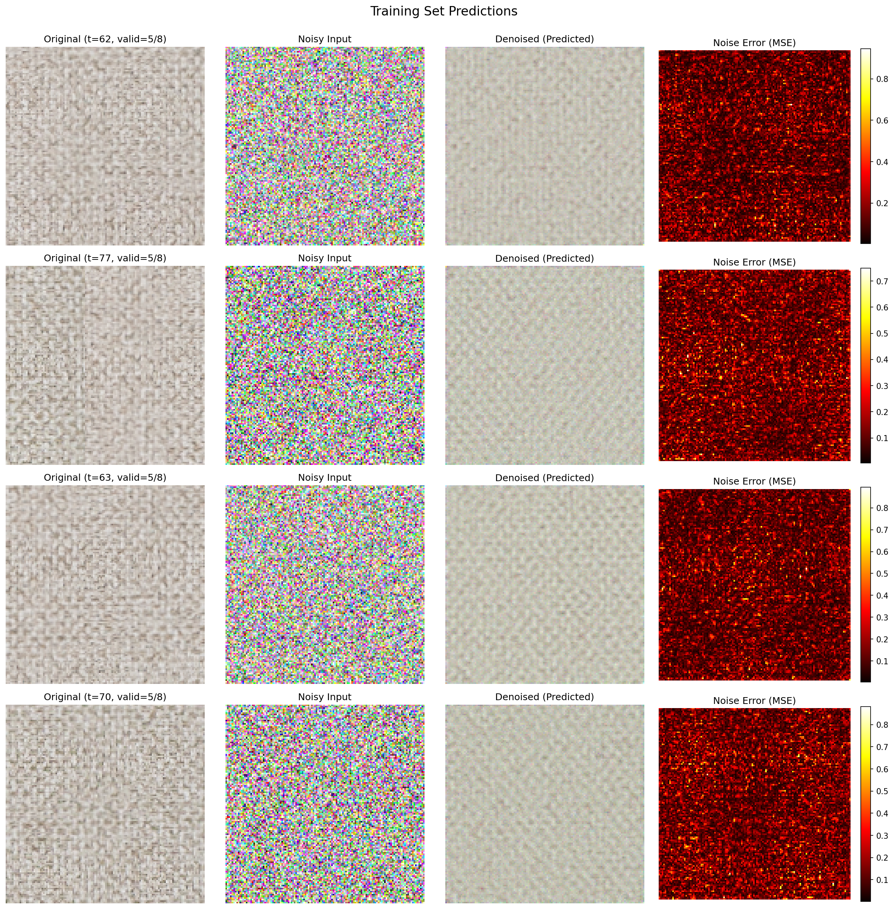
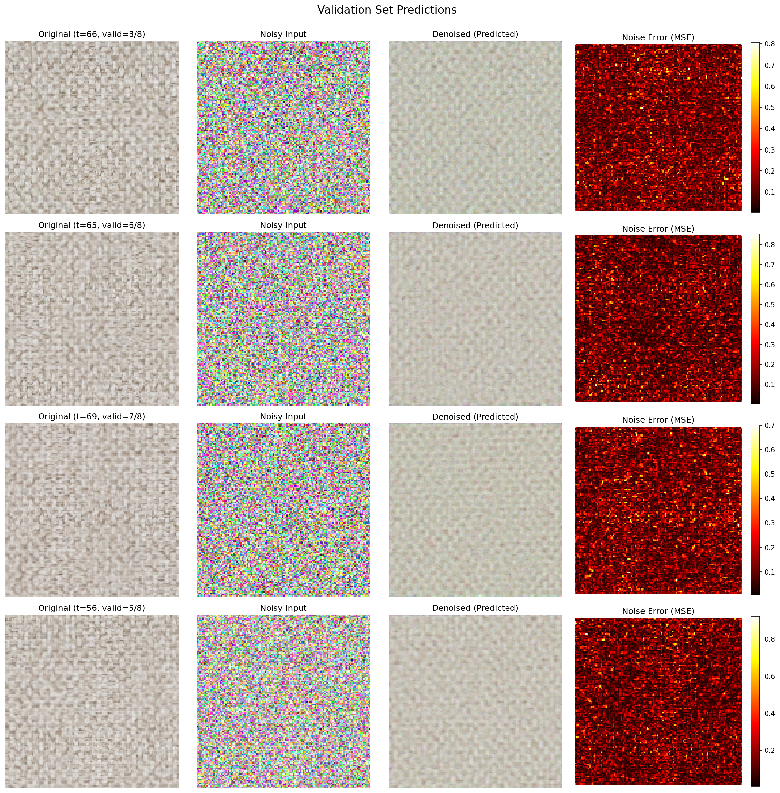
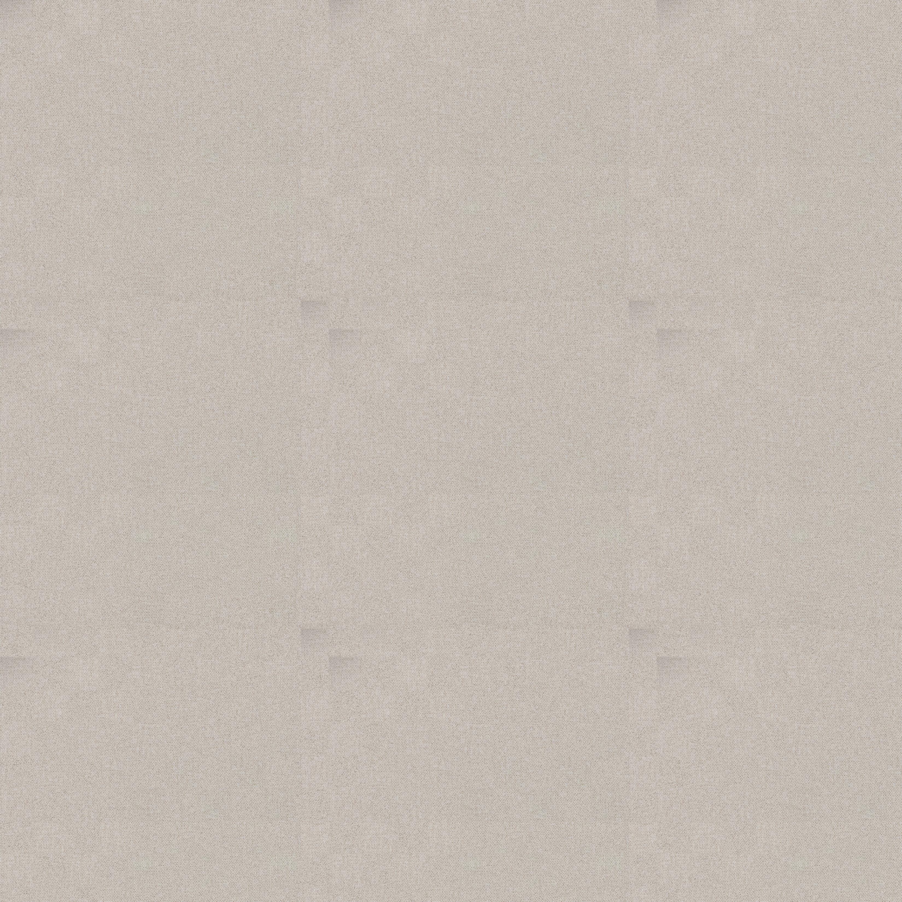

# Texture Synthesis with Diffusion Model

Хотелось попробовать сделать генерацию текстур не используя существующие решения 

## Идея

Основная задумка такая что берем текстуру и разбиваем ее на тайлы одинакового размера (128x128) при этом для каждого тайла берем его 8 соседей (все что вокруг него) и делаем диффузионную модель которая генерирует центральный тайл учитывая этих соседей чтоб текстура была непрерывная

для того чтоб модель понимала где какой сосед находится сделал position embedding для каждой позиции соседа то есть модель понимает взаимное положение к центральному генерируему обьекту

## Как это работает

сначала тренируем модель на тайлах из оригинальной текстуры модель учится генерировать центральный тайл по соседям также специально делал паттерны где некоторые соседи отсутствуют чтоб модель была более адаптирована для генерации новых тайлов в финальной генерации текстуры

оригинальная картинка делится на разные тайлы 

после того как модель натренирована можно генерировать текстуру в 3 раза больше оригинала тут столкнулся с проблемой сначала думал просто построчно генерировать но из-за того что при каждой генерации присутсовала ошибка в плане шума она накапливалась

поэтому сделал так берем оригинальную текстуру разбиваем на тайлы и распределяем их в шахматном порядке чтоб они не были прямыми соседями друг друга а потом генерируем недостающие тайлы между ними так ошибка не накапливается

еще была проблема с цветом сгенерированные тайлы были другого оттенка оказалось проблема в клиппинге после фикса все заработало

## Результаты

вот что получилось

### Примеры работы диффузионной модели

### Финальная сгенерированная текстура 3x3

### Финальная сгенерированная текстура 3x3 (с проблемой по цвету)

## Запуск

просто запускаете main() можно настроить параметры в начале функции

Гипер параметры
TILE_SIZE = 128
EPOCHS = 50
BATCH_SIZE = 16

если модель уже натренирована ставьте `EPOCHS = 0` и она просто загрузится и сгенерирует текстуру